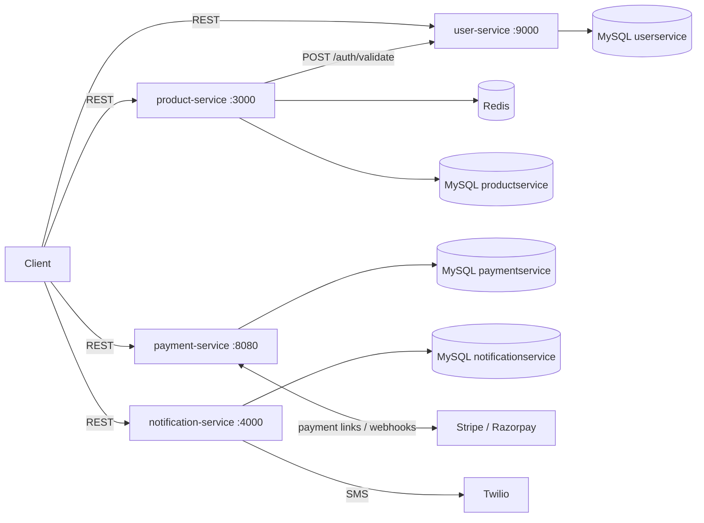

# E-commerce Backend — Microservices Capstone

Backend for an e-commerce platform, built as the capstone project of the
Scaler Academy / Woolf **MSc Computer Science — Backend Specialisation**
(project module Aug 2023 – Feb 2024, guided by Naman Bhalla).

The system is split into independently deployable Spring Boot microservices,
each owning its own MySQL schema:

| Service | Port | Responsibility |
|---|---|---|
| [`product-service`](product-service) | 3000 | Product & category catalogue, search with pagination, Redis caching, seller-only writes |
| [`user-service`](user-service) | 9000 | Sign-up, login/logout, JWT session tokens, token validation, roles (RBAC) |
| [`payment-service`](payment-service) | 8080 | Payment links via Stripe / Razorpay (strategy pattern), Stripe webhooks, payment event log |
| [`notification-service`](notification-service) | 4000 | Notification requests and history; SMS delivery via Twilio |

## Architecture



* **Authentication** — `user-service` issues an HS256-signed JWT on login and
  stores it as a session. Other services send the token to
  `POST /auth/validate`, which returns the user id, roles and session status.
* **Authorisation** — `product-service` allows create/update/delete only for
  users with the `Seller` role, and only on products they created.
* **Caching** — `GET /products/{id}` uses a Redis cache-aside layer, evicted on
  update/delete. See [benchmark](benchmark) for measured impact
  (mean latency −35%, throughput +53%).
* **Payments** — `PaymentGatewayChooserStrategy` selects the gateway; Stripe
  status changes arrive through a Stripe webhook (signature checked with the endpoint secret) and are recorded as
  `PaymentEvent`s.

## Tech stack

Java 17 · Spring Boot 3 (Web, Data JPA, Security) · MySQL 8 · Flyway ·
Redis · JJWT · BCrypt · Stripe & Razorpay SDKs · Twilio SDK · Maven · Docker

## Running locally

Prerequisites: Java 17, Maven 3.9+, Docker.

```bash
# 1. Infrastructure (MySQL with one schema per service, Redis)
docker compose up -d --wait

# 2. Services — each in its own terminal
cd user-service && ./mvnw spring-boot:run
cd product-service && ./mvnw spring-boot:run
cd payment-service && ./mvnw spring-boot:run        # needs Stripe/Razorpay keys, see below
cd notification-service && ./mvnw spring-boot:run
```

Every setting has a local default; override with environment variables:

| Variable | Used by | Default |
|---|---|---|
| `DB_URL`, `DB_USERNAME`, `DB_PASSWORD` | all | local MySQL, `serviceAdmin` |
| `PORT` | all | see table above |
| `JWT_SECRET` | user-service | dev-only key — **set in any real environment** |
| `USER_SERVICE_URL` | product-service | `http://localhost:9000` |
| `REDIS_HOST`, `REDIS_PORT` | product-service | `localhost:6379` |
| `PRODUCT_CACHE_ENABLED` | product-service | `true` |
| `STRIPE_KEY_ID`, `STRIPE_KEY_SECRET`, `STRIPE_ENDPOINT_SECRET` | payment-service | — (required) |
| `RAZORPAY_KEY_ID`, `RAZORPAY_KEY_SECRET` | payment-service | — (required) |

### Quick walkthrough

```bash
# one-time: seed roles (user-service creates its tables on first start)
docker compose exec mysql mysql -userviceAdmin -pserviceAdmin userservice \
  -e "INSERT INTO role(role) VALUES ('Admin'),('Seller'),('NormalUser');"

curl -X POST localhost:9000/auth/signup -H 'Content-Type: application/json' \
     -d '{"userName":"alice","password":"secret"}'
curl -i -X POST localhost:9000/auth/login -H 'Content-Type: application/json' \
     -d '{"userName":"alice","password":"secret"}'
# -> Set-Cookie: auth-token:<JWT>

curl localhost:3000/products/<uuid> -H "Authorization: <JWT>"
curl -X POST localhost:3000/search -H 'Content-Type: application/json' -d '{"searchText":"phone"}'
```

Per-service API details are in each service's README.

## Repository layout

```
product-service/       Spring Boot app (catalogue, search, cache)
user-service/          Spring Boot app (auth, sessions, roles)
payment-service/       Spring Boot app (Stripe/Razorpay, webhooks)
notification-service/  Spring Boot app (notifications, Twilio SMS)
benchmark/             Cache latency benchmark script and results
docker/                MySQL init script
docker-compose.yml     Local MySQL + Redis
```

## Project history

The services were originally developed in separate repositories and merged
here with their full commit history preserved:
[productservice](https://github.com/zaeemashfaq/productservice),
[userService](https://github.com/zaeemashfaq/userService),
[notificationservice](https://github.com/zaeemashfaq/notificationservice);
payment-service was previously local only. Commits from October 2026 are
submission clean-up: configuration externalised, secrets removed, Redis cache
for product lookups and its benchmark, and documentation.

## Known limitations

* No order/cart service yet; payment-service accepts an `orderId` from the caller.
* Every product request makes a synchronous call to user-service to validate the
  token; verifying the JWT locally or caching validation results would remove
  this hop.
* notification-service reads Twilio credentials from the console and only the
  SMS channel is implemented; the AMQP starter is included for planned
  asynchronous delivery but not yet wired.
* Test coverage is minimal.
